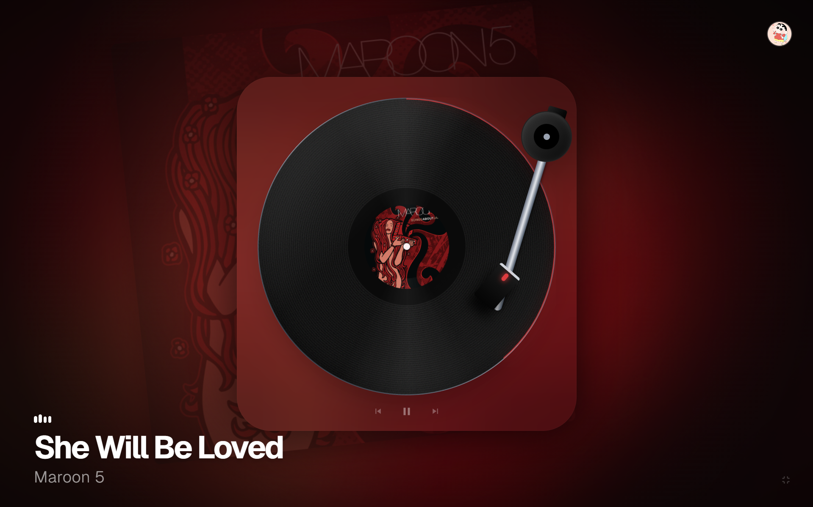

<div align="center">


# 🎵 Viny

**A vinyl record player visualizer powered by Spotify**

[](https://nextjs.org)
[](https://react.dev)
[](https://tailwindcss.com)
[](https://www.typescriptlang.org)
[](LICENSE)

</div>

---

## ✨ About

**Viny** brings the nostalgic aesthetic of a vinyl record player to your screen. Connect your Spotify account and watch your currently playing track come to life — complete with album art, dominant color extraction, and a spinning vinyl animation.



## 🚀 Features

- 🎧 **Spotify Integration** — Real-time now-playing data via Spotify Web API
- 🎨 **Dynamic Theming** — Extracts dominant colors from album art for a vibrant, adaptive UI
- 💿 **Vinyl Animation** — Smooth spinning record with tonearm tracking
- ⏯️ **Playback Controls** — Play, pause, skip, and previous track directly from the UI
- 🖥️ **Fullscreen Mode** — Immersive full-screen visualizer
- 🖼️ **Animated Album Background** — Subtle floating album art animation behind the turntable
- ⚡ **Smart Polling** — Efficient API usage with adaptive polling near track transitions
- 🎯 **Fully Typed** — End-to-end TypeScript

## 🛠️ Tech Stack

| Technology                | Purpose                |
| :------------------------ | :--------------------- |
| **Next.js 16**      | Framework & API routes |
| **React 19**        | UI rendering           |
| **Tailwind CSS 4**  | Styling                |
| **TypeScript 5**    | Type safety            |
| **Spotify Web API** | Music data             |

## 📦 Getting Started

### Prerequisites

- [Node.js](https://nodejs.org) (v18+)
- A [Spotify Developer](https://developer.spotify.com/dashboard) application

### Installation

```bash
# Clone the repository
git clone https://github.com/sakshamgupta912/Viny.git
cd Viny

# Install dependencies
npm install
```

### Spotify Setup

1. Go to the [Spotify Developer Dashboard](https://developer.spotify.com/dashboard)
2. Create a new application
3. Add `http://localhost:3000/api/auth/callback/spotify` as a **Redirect URI** in your app settings
4. Copy your **Client ID** and **Client Secret**

### Environment Variables

Create a `.env.local` file in the root directory:

```env
SPOTIFY_CLIENT_ID=your_client_id
SPOTIFY_CLIENT_SECRET=your_client_secret
SPOTIFY_REDIRECT_URI=http://localhost:3000/api/auth/callback/spotify
```

### Run

```bash
# Start the development server
npm run dev
```

Open [http://localhost:3000](http://localhost:3000) and click **Connect Spotify** to get started.

## 📁 Project Structure

```
src/
├── app/
│   ├── layout.tsx          # Root layout
│   ├── page.tsx            # Main vinyl visualizer
│   ├── globals.css         # Global styles
│   └── api/
│       ├── auth/callback/spotify/   # OAuth callback
│       └── spotify/
│           ├── login/               # Spotify login
│           ├── logout/              # Spotify logout
│           ├── now-playing/         # Now playing endpoint
│           └── player/              # Playback controls (play/pause/next/prev)
public/                     # Static assets
```

## 📜 License

This project is licensed under the **Apache License 2.0** — see the [LICENSE](LICENSE) file for details.

Copyright © 2026 **Saksham Gupta**

---

<div align="center">

Made with ❤️ and 🎶

</div>
